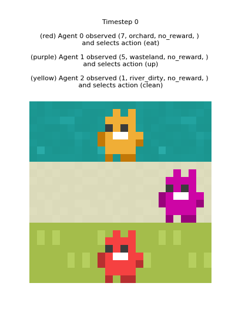

# Multi-Agent Active Inference with Theory of Mind

In this repository, we compare active inference agents with and without theory of mind (ToM) capabilities in multi-agent cooperative tasks. This work implements sophisticated active inference planning using [pymdp](https://github.com/infer-actively/pymdp/tree/v1.0.0_alpha) and we have developed our own planning algorithms that are different to the pymdp ones by equipping them with ToM and being better optimised (see `/tom/planning/`). The ToM planning algorithm is detailed in the paper: ["Theory of Mind Using Active Inference: A Framework for Multi-Agent Cooperation"](https://arxiv.org/abs/2508.00401).

## Installation

```bash
git clone <repository-url>
cd tom
python3.11 -m venv .venv --prompt="tom"
source .venv/bin/activate
pip install -e .
pip install git+https://github.com/infer-actively/pymdp.git@v1.0.0_alpha
```

## Tasks

### Three cooperative tasks in custom 3×3 grid environments:

**Collision Avoidance**: Agents begin at opposing corners of a 3×3 grid and must traverse to the opposite corner without occupying the same location (i.e., avoiding collisions).


*Note: in the gif above, the red agent is equipped with ToM*

**Foraging**: Agents must collect apples that spawn in the orchard at a rate of 0.25 per timestep.


*Note: in the gif above, the red agent is equipped with ToM*

**Clean Up**: Agents must collect apples that spawn in the orchard at a rate of 0.25, but only after cleaning the river (requiring at least 2 clean river cells).



*Note: in the gif above, the red agent is equipped with ToM*

### One cooperative task from [JaxMARL](https://github.com/FLAIROx/JaxMARL):

**Overcooked**: Agents must cooperate to prepare and deliver soup by collecting onions, cooking them in pots, plating the soup, and delivering it to the service station.


*Note: the gif above is the non-ToM version (ToM version WIP). Model is carefully crafted such that blue agent avoids deadlock by yielding to red agent until soup is ready. Both agents use active inference.*

## Usage

See the notebooks in `notebooks/experimental/` for examples of running experiments with ToM and non-ToM agents across different tasks.
